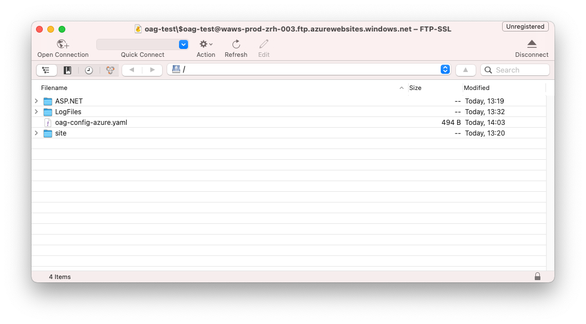

# Deploy OAG on Azure App Service

This article describes the needed setting to successfully deploy OAG on a Azure App Service Instance. In fact, this is the current setup for the demo instance deployed [here](https://oag.azurewebsites.net).

## Create a Linux based Docker App Service

### Create an App Service Instance

First you need to create a app service instance. It is important that you select Docker as publishing method and Linux as operating system. In this example a Azure app service plan already exists. You need to create a new app service plan if you don't have a linux plan.


### Configure the Docker Image

Next you need to add the name and tag from the official release on DockerHub. You should select the latest release and not any of the snapshot version because it is more safe to pin the exact version you want. Otherwise the app service might pull a new version when it restarts.


### Configure the Network Port 

After you created the resources there are some settings that you need to adjust. Because the app service environment does not know, on which port OAG ist listening (8080 per default) you need to specify that over the following app service setting:

`WEBSITES_PORT=8080`


After you have saved the new setting Azure will restart the app service. This usually takes some time because Azure seems to pull the image again which is quite slow. You can use the log stream to view the progress. If you don't see anything yet, please be patient.

After you have seen the following log your OAG deployment is ready to serve its first request. Visit the url of your app service and you should find an example page.

`Container ... for site ... initialized successfully and is ready to serve requests.`

### Persist OAG Logs

Next, please make sure the logs from your OAG instance are persisted with the App Service Logs settings. You can choose a different quota.


From now on you should also see the OAG logs with the log stream features:


### Visit your OAG instance :tada:

Congratulations, you have a minimal running instance of OAG. Next step will be to upload you on custom configuration file.


## Upload your custom configuration file

Azure app service has the possibility to mount persistent storage to your docker container, we will use that for your custom OAG configuration file. After you activated the persistent storage you can upload the config file via SFTP.

### Enable App Service Storage

First, add the following setting to you app service settings:

`WEBSITES_ENABLE_APP_SERVICE_STORAGE=true`

### Configure your Deployment Credentials

Then you need to define a password for SFTP deployment via "Deployment Center/FTPS Settings" unless you did this already for another service on your app service plan. After you noted the password you just set go the properties page and look up the connection settings. Use a program like Cyberduck to connect to the SFTP service of Azure. (Of course you can also automate this in a CI/CD pipeline)


Here is an example of a minimalistic OAG configuration:
```yaml
hostUri: env:HOSTURI

routes:
  echo:
    type: apiforspa
    path: /**
    url: https://nellydemoapp.azurewebsites.net
    allowAnonymous: yes

loginProviders:
  google:
    type: oidc
    with:
      authEndpoint: https://accounts.google.com/o/oauth2/auth
      tokenEndpoint: https://oauth2.googleapis.com/token
      clientId: env:GOOGLE_CLIENT_ID
      clientSecret: env:GOOGLE_CLIENT_SECRET
      scopes: [ "openid", "email", "profile"]
```

### Upload your Configuration File

Before you upload the configuration file it make sense to use a local instance of OAG to verify that it contains no errors. It much faster way than to debug via the app service.



### Configure the OAG Config File Path

After you uploaded the file via SFTP you need to add the following app service settings:

`OAG_CONFIG_PATH=/home/oag-config-azure.yaml` Or whichever name you gave the file. But note the /home/ prefix because the SFTP folder is mounted on the /home path.

### Configure settings with the `env:` Prefix

Did you note that the "env:" prefix in the configuration file to reference a environment variable? Since app service settings are injected via environment variable you should also add the actual path of your OAG as app service setting. In our case this looks like follows:

`HOSTURI=https://oag-test.azurewebsites.net`

If you want to test the login with Google you need to create your own client_id and client_secret via the Google api console. In this case you also need to add the following app service settings:

```
GOOGLE_CLIENT_ID=<your client id>
GOOGLE_CLIENT_ID=<your client secret>
```

After you saved the settings the app service restarts and OAG will load the new configuration file. If you cannot connect to you OAG instance please check the logs for error messages. If everything goes will you'll see the new route that you configured.

### Verify the new Configuration

You can also verify the login functionality by accessing `/auth/google/login` If you configured you client_id and client_secret correctly you will have an active session and can check that via the `/auth/session` endpoint.

## Further things to do (optional):

* Disable unencrypted FTP via "Configuration/General settings/FTP state"
* Enable support for HTTP2 via "Configuration/General settings/HTTP Version"
* Configure a custom domain via Custom domains the "Custom Domain" settings
* Reduce the attack surface using private networking between OAG and your backend services
* Enable Azure Log Analytics and forward the OAG logs to a Azure Log Analytics workspace
* Enable health checks with the Health setting