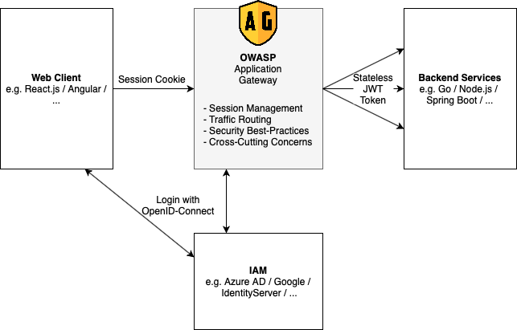

# Introduction

🏗️ **OWASP Application Gateway is work-in-progress. No productive version has been released yet. - We are on Version 0.5.2. [](https://github.com/gianlucafrei/Application-Gateway/releases)**

OWASP Application Gateway is an HTTP reverse proxy that sits between your web application and the client and handles Oauth2 login and session management. For you, as a developer, OWASP Application Gateway removes the hassle to implement complicated oauth2 logic in the backend and frontend so you can focus totally on your applications logic.



## Design Principles

### Secure by default

Implementing secure logins and session management became much more complicated within the last few years. OWASP Application Gateway aims to make this easier. Also, it implements many security hardening measures out of the box.

### Stateless

Wherever possible, OWASP Application Gateway is stateless. All session information is stored within encrypted cookies on the clients. Stateless session management makes it a lot easier to deploy OWASP Application Gateway on multiple nodes.

### Configuration based

OWASP Application Gateway's behavior is controlled with a central configuration file describing all routes and Oauth2 integrations. This makes it easier to review the configuration for security issues and to debug on different environments. The deployment and scaling are straightforward; configure the config file's file path, and that's all you need to do.

## Configuration File

OWASP Application Gateway is fully configured with a simple and easy to understand configuration file. Details are documented in the next sections.

```yaml
hostUri: https://example.com

routes:
  httpbin:
    type: webapplication
    path: /**
    url: https://httpbin.org
    allowAnonymous: yes
  echo:
    type: webapplication
    path: /echo/**
    url: https://nellydemoapp.azurewebsites.net
    allowAnonymous: no

loginProviders:
  google:
    type: oidc
    with:
      authEndpoint: https://accounts.google.com/o/oauth2/auth
      tokenEndpoint: https://oauth2.googleapis.com/token
      clientId: 372143946338-48et57uhmcumku7am3ocvva0idc7u0td.apps.googleusercontent.com
      clientSecret: env:GOOGLE_CLIENT_SECRET
      scopes: [ "openid", "email" ]

  github:
    type: github
    with:
      authEndpoint: https://github.com/login/oauth/authorize
      tokenEndpoint: https://github.com/login/oauth/access_token
      clientId: 163ad3b08c3829216ba1
      clientSecret: env:GITHUB_CLIENT_SECRET
      scopes: [ "user", "email" ]

securityProfiles:
  webapplication:
    responseHeaders:
      Server: <<remove>>
      X-Powered-By: <<remove>>
      X-XSS-Protection: 1;mode=block;
      X-Frame-Options: SAMEORIGIN
      X-Content-Type-Options: nosniff
      Referrer-Policy: strict-origin-when-cross-origin
      Content-Security-Policy: base-uri 'self';object-src 'self'
      Permissions-Policy: geolocation=(),notifications=(),push=(),microphone=(),camera=(),speaker=(),vibrate=(),fullscreen=(),payment=(),usb=(),magnetometer=(),gyroscope=(),accelerometer=()
      Strict-Transport-Security: max-age=31536000; includeSubDomains


traceProfile:
  forwardIncomingTrace: true
  maxLengthIncomingTrace: 254
  acceptAdditionalTraceInfo: false
  maxLengthAdditionalTraceInfo: 254
  sendTraceResponse: true
  type: w3cTrace
```

## How to run

You have two options on how to run OWASP Application Gateway: There is an official docker image that you can just works out of the box. You just need to mount the config file via docker volumes. If you don't want to use docker you can also use the download the released jar file. Of course you can also build OWASP Application Gateway by yourself with Maven.

### Docker Release

You can find the Docker image [here](https://hub.docker.com/r/gianlucafrei/nellygateway)

Download and Start:
```bash
# Download image of nelly
docker pull owasp/application-gateway:main-SNAPSHOT

# Download sample config and adapt it to your needs
curl https://raw.githubusercontent.com/gianlucafrei/Application-Gateway/main/oag/sample-config.yaml >> oag-config.yaml
vim oag-config.yaml

# Start the container
docker run -e NELLY_CONFIG_PATH=/app/oag-config.yaml -v ${PWD}/oag-config.yaml:/app/oag-config.yaml owasp/application-gateway:main-SNAPSHOT
```

### Jar release

```bash
curl -s https://api.github.com/repos/gianlucafrei/Application-Gateway/releases/latest \
| grep "browser_download_url.*zip" \
| cut -d : -f 2,3 \
| tr -d \" \
| wget -qi -

unzip oag*.zip
cd build/app
java -jar oag.jar

```

### Compile it Yourself

The easiest way is to use Docker to build OWASP Application Gateway.

```bash
docker build -t owasp/application-gateway:SNAPSHOT .
docker run -p 8080:8080 owasp/application-gateway:SNAPSHOT
```

If you don't want to use Docker you can build the jar by yourself with Maven:

```bash
mvn package -f oag/pom.xml -Dmaven.test.skip=true
```

You may also use your IDE for building OAG. Please see [Setup OAG for development](/docs/Setup-for-OAG-development) for instructions using IntelliJ as an example.

## Functionality

- [x] HTTPS Redirection with Proxy Awareness
- [x] OpenID Connect Login with multiple providers
- [x] Multiple Backend routes
- [x] Authenticated routes
- [x] Request Logging
- [x] Add and remove response headers
- [x] Secure, HTTP-only and same-site session cookies
- [x] Forward id token to backend
- [x] Upstream authentication with API key
- [x] GitHub Login support
- [x] Method whitelisting
- [x] CSRF protection
- [x] Rolling sessions
- [x] W3C compliant request tracing  


Ideas:

- [ ] Header whitelisting
- [ ] Report URI Endpoint
- [ ] Default configuration
- [ ] ...
